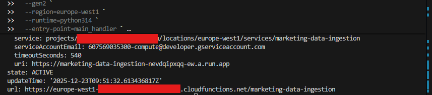
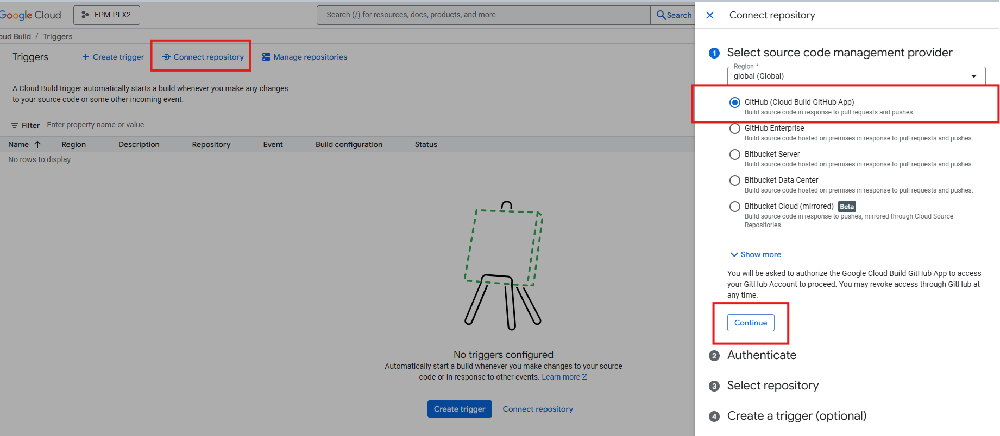
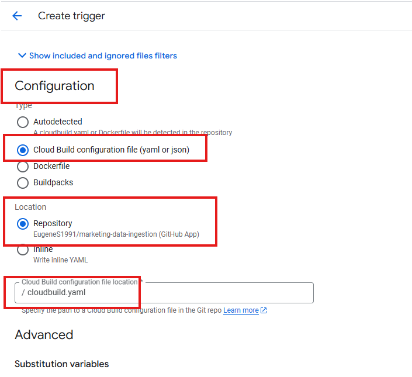
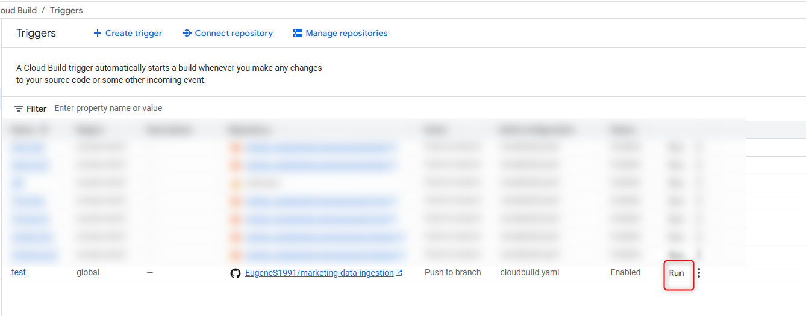
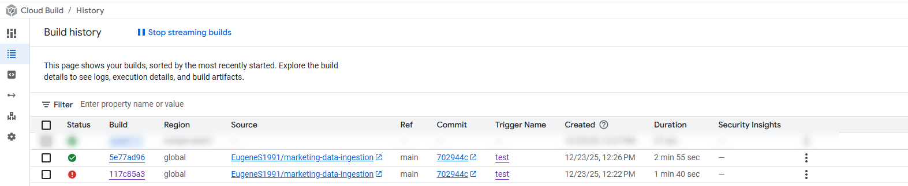

# Marketing Data Ingestion Framework

A serverless Python-based ETL framework designed to automate data extraction from marketing platforms and load it directly into Google BigQuery.

## Supported Connectors
Currently, the following integrations are available:
- **Facebook Ads**: Monthly/Daily Insights extraction (campaigns, ad sets, ads, spend, clicks, impressions, etc.).
- **HubSpot**: 
  - **Email Events**: High-volume stream of interaction data (opens, clicks, bounces).
  - **Email Campaigns**: Metadata and settings for marketing campaigns.

## Cloud Services Stack
- **Google Cloud Functions (GCF)**: Executes the Python logic (Runtime: Python 3.11).
- **Google Cloud Scheduler**: Automates the trigger of the GCF via HTTP POST requests on a specified schedule.
- **Google BigQuery**: Serves as the data warehouse for all ingested marketing metrics.

---

## Deployment Instructions

### Method 1: Deploy via CLI (Command Line Interface)

1. **Install Google Cloud CLI**: Download and install the [Google Cloud CLI](https://cloud.google.com/sdk/docs/install).
2. **Authenticate**: Open your terminal and log in to your Google Account:
   ```powershell
   gcloud auth login
   ```
3. **Set Project**: Ensure you are working in the correct GCP project:
   ```powershell
   gcloud config set project YOUR_PROJECT_ID
   ```
4. **Deploy the Function**: Run the following command from the project root directory:
   ```powershell
   gcloud functions deploy marketing-data-ingestion `
     --gen2 `
     --region=europe-west1 `
     --runtime=python311 `
     --entry-point=main_handler `
     --trigger-http `
     --memory=512Mi `
     --timeout=540s `
     --ingress-settings=all `
     --no-allow-unauthenticated `
     --min-instances=0 `
     --max-instances=1 `
     --source=.
   ```
   *Note: If the deployment is successful, you will see the function details in your terminal:*
   

### Method 2: Deploy via Cloud Build (Automated Triggers)

1. **Connect Repository**:
   - Go to the **Cloud Build** section in GCP Console.
   - Navigate to **Triggers** and click **Connect Repository**.
   - Select **GitHub (Cloud Build GitHub App)**, authenticate, and select your account and repository.
   

2. **Create Trigger**:
   - Click **Create Trigger**.
   - **Name**: Enter a name for the trigger.
   - **Region**: Select your preferred region.
   - **Event**: Push to a branch.
   - **Source**: Select your repository and the `main` branch.
   - **Configuration**: Select **Cloud Build configuration file (yaml or json)**.
   
   - Click **Create**.

3. **Run Trigger**:
   - You can manually start the deployment by clicking **Run** on the created trigger.
   

4. **Verify Deployment**:
   - Go to the **History** tab in Cloud Build to ensure the build finished successfully.
   

---

## Setup Cloud Scheduler
Once the function is deployed, create a job in **Cloud Scheduler**:
- **Target Type**: HTTP.
- **URL**: Your Cloud Function URL.
- **HTTP Method**: POST.
- **Auth Header**: Add OIDC token (with `Cloud Functions Invoker` role).

### Example Payloads (JSON Body)

#### HubSpot Sync
```json
{
  "source": "hubspot",
  "collection": "email_event",
  "access_token": "your_token",
  "project_id": "your_project",
  "dataset_id": "marketing_dataset",
  "table_id": "hubspot_events"
}
```

#### Facebook Sync
```json
{
  "source": "facebook",
  "collection": "insights",
  "access_token": "your_token",
  "account_id": "12345",
  "app_id": "app_id",
  "app_secret": "app_secret",
  "project_id": "your_project",
  "dataset_id": "marketing_dataset",
  "table_id": "fb_insights"
}
```
